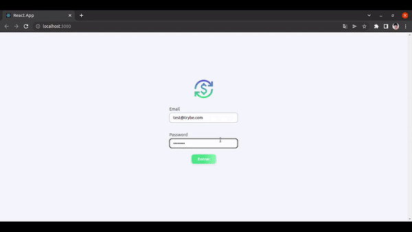

<h1 align="center">💸 Trybewallet</h1>
<h3 align="center">Financial Management</h3>

Trybewallet is a platform where you can manage your financials in the best and easiest way. In this project, I used data from an API that returns several currencies. I developed this project through Trybe course, in Front End module.

  

<h3 align="left">Skills</h3>

- Make requests from an API
- React component lifecycles
- Local State
- BrowserRouter, React Router, Route, Switch
- Redirect
- Link

<h3 align="left">Connect with me</h3>

<h3 align="left">Languages and Tools</h3>

          

